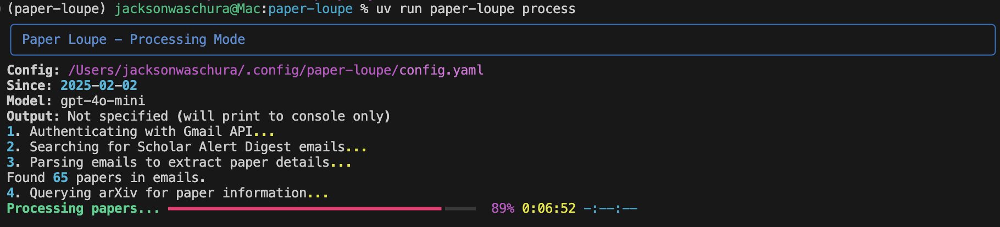

# Paper Loupe

A CLI-based application to manage and prioritize your research paper backlog.

## Overview

Paper Loupe helps you stay on top of your research paper reading list by:

1. Accessing your Gmail to find Scholar Alert Digest emails
2. Extracting paper information from these digests
3. Finding corresponding arXiv entries
4. Scoring papers based on relevance to your research questions
5. Presenting a ranked list of papers to help you prioritize your reading



## Installation

This is a first-pass implementation to demonstrate the CLI interface without full functionality.

### Prerequisites

- Python 3.13 or higher
- uv package manager (`curl -LsSf https://astral.sh/uv/install.sh | sh`)
- Gmail account with Scholar Alert Digests

### Setup

1. Clone this repository:
   ```bash
   git clone https://github.com/yourusername/paper-loupe.git
   cd paper-loupe
   ```

2. Install the tool using uv:
   ```bash
   uv sync
   ```

3. Create a configuration directory and copy the example configuration:
   ```bash
   mkdir -p ~/.config/paper-loupe
   cp config_example.yaml ~/.config/paper-loupe/config.yaml
   ```

4. Edit the configuration file to include your research questions:
   ```bash
   vim ~/.config/paper-loupe/config.yaml
   ```

## Usage

### Initial Setup

Initialize Paper Loupe and set up Gmail API authentication:

```bash
uv run paper-loupe setup
```

### Process Papers

Process emails and rank papers based on relevance:

```bash
# Process emails from the last 30 days (default)
uv run paper-loupe process

# Additional options:
# --since YYYY-MM-DD   Process emails since a specific date
# --model MODEL_NAME   Use a specific LLM model (run 'paper-loupe models' to see options)
# --output PATH        Save output to a file
```

Examples:
```bash
# Process emails since January 1, 2023 using GPT-4o Mini
uv run paper-loupe process --since 2023-01-01 --model gpt-4o-mini

# Process emails and save results to a CSV file
uv run paper-loupe process --output ~/paper_rankings.csv
```

### View Papers

Show details of papers in the database:

```bash
# List all papers
uv run paper-loupe show

# Show details for a specific paper
uv run paper-loupe show PAPER_ID
```

### View Available Models

List available LLM models and their details:

```bash
# List all available models
uv run paper-loupe models

# Show details for a specific model
uv run paper-loupe models MODEL_NAME
```

<details>
<summary><b>Development Information</b></summary>

### Testing

Run tests with pytest:

```bash
# Install dependencies
uv sync

# Run tests
uv run -m pytest -xvs
```

### Automated Code Quality with Pre-commit

Set up pre-commit to automatically run code quality tools before each commit:

```bash
# Install pre-commit hooks
uv run pre-commit install

# Run pre-commit checks manually
uv run pre-commit run --all-files
```

Pre-commit will automatically run these checks:
- Black (code formatting)
- isort (import sorting)
- Ruff (linting)
- Type checking with mypy
- Other checks like trailing whitespace and YAML validation

</details>

## To-Do List

The following items need to be completed for full functionality:

### LLM Integration
- [x] Set up secure API key management for OpenAI/Anthropic
- [x] Complete paper relevance scoring using LLM APIs
- [x] Decide on prompt templates for paper evaluation

### Pulling Threads Together
- [x] Implement the high-level workflow for paper processing
- [x] Implement the config system

### Clean Up
- [ ] Rewrite README to reflect final user experience
- [ ] Improve file and method docstrings

### Longer Term
- [ ] Create a ~25 sample paper dataset to test question relevance prompts.
- [ ] Evaluate the performance of different LLMs and prompts to find best value.
- [ ] Add an option to construct and send an email with top papers to read.

## License

This project is licensed under the MIT License - see the LICENSE file for details.
